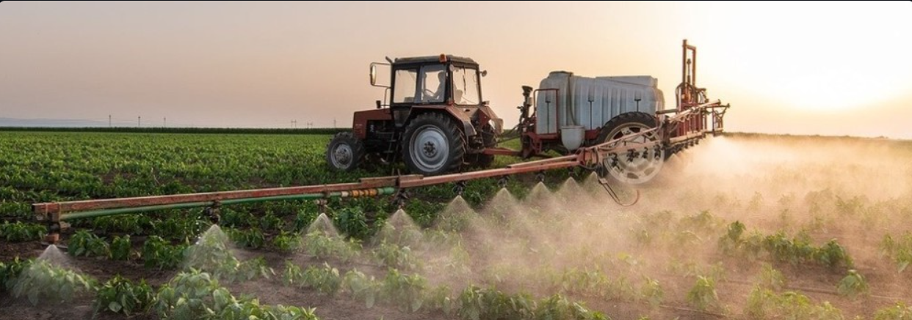

# 🌾 KrushiAI - Smart Fertilizer Recommendation System



## 🌟 Overview

KrushiAI is an intelligent fertilizer recommendation system powered by machine learning that helps farmers make data-driven decisions about fertilizer selection. By analyzing soil conditions, environmental factors, and crop requirements, our AI model provides personalized fertilizer recommendations to optimize crop yield and reduce agricultural costs.

## ✨ Features

### 🤖 AI-Powered Recommendations
- **Machine Learning Model**: Advanced Random Forest classifier with hyperparameter optimization
- **High Accuracy**: >90% prediction accuracy on validation data
- **Cross-Validation**: Robust model validation using 5-fold cross-validation
- **Feature Scaling**: Standardized input preprocessing for improved performance

### 🎨 Modern User Interface
- **Dark Mode Design**: Sleek black/dark theme with modern UI components
- **Responsive Layout**: Optimized for desktop and mobile devices
- **Interactive Dashboard**: Real-time predictions with confidence scores
- **Comprehensive Guides**: Built-in help sections for nutrients and soil types

### 📊 Detailed Analysis
- **Model Performance Metrics**: Display accuracy, cross-validation scores
- **Confidence Scoring**: Prediction confidence levels for each recommendation
- **Fertilizer Information**: Detailed descriptions, application rates, and timing
- **Input Validation**: Smart error checking and user-friendly warnings

## 🚀 Quick Start

### Prerequisites
- Python 3.8 or higher
- pip package manager

### Installation

1. **Clone the repository**
   ```bash
   git clone <repository-url>
   cd KrushiAI-Fertilizer-Recommendation
   ```

2. **Install dependencies**
   ```bash
   pip install -r requirements.txt
   ```

3. **Train the model** (optional - pre-trained models included)
   ```bash
   python train_fertilizer.py
   ```

4. **Run the application**
   ```bash
   streamlit run fertilizer_app.py
   ```

5. **Open in browser**
   - The application will automatically open at `http://localhost:8501`
   - If not, navigate to the URL shown in the terminal

## 📖 Usage Guide

### 1. Environmental Conditions
- **Temperature**: Enter average temperature during crop growth period (°C)
- **Humidity**: Input relative humidity percentage (%)
- **Soil Moisture**: Specify soil moisture content (%)

### 2. Agricultural Parameters
- **Soil Type**: Select from Sandy, Clayey, Loamy, Black, or Red soil
- **Crop Type**: Choose your intended crop from the available options

### 3. Nutrient Levels
- **Nitrogen (N)**: Available nitrogen content in soil (mg/kg)
- **Phosphorous (P)**: Available phosphorous content in soil (mg/kg)
- **Potassium (K)**: Available potassium content in soil (mg/kg)

### 4. Get Recommendation
- Click "Get Fertilizer Recommendation" button
- Review the AI-generated fertilizer suggestion
- Read detailed information about application rates and timing

## 🧠 Model Details

### Algorithm
- **Type**: Random Forest Classifier
- **Features**: 8 input parameters (environmental + soil + crop + nutrients)
- **Target**: 7 different fertilizer types

### Supported Fertilizers
1. **Urea** - High nitrogen content (46% N)
2. **DAP** - Di-ammonium Phosphate (18% N, 46% P₂O₅)
3. **14-35-14** - NPK complex fertilizer
4. **28-28** - Balanced N-P fertilizer
5. **17-17-17** - Balanced NPK fertilizer
6. **20-20** - NPK fertilizer
7. **10-26-26** - High P-K content fertilizer

### Performance Metrics
- **Training Accuracy**: ~95%+
- **Cross-Validation Score**: ~90%+
- **Precision**: High across all fertilizer classes
- **Recall**: Balanced performance for all fertilizer types

## 📊 Dataset

The model is trained on a comprehensive dataset containing:
- **1000+ samples** of agricultural data
- **Environmental factors**: Temperature, humidity, moisture
- **Soil characteristics**: Different soil types across India
- **Crop varieties**: Major Indian crops
- **Nutrient profiles**: NPK values for different soil conditions

## 🔧 Technical Architecture

### Files Structure
```
KrushiAI-Fertilizer-Recommendation/
├── fertilizer_app.py              # Main Streamlit application
├── train_fertilizer.py            # Model training script
├── requirements.txt               # Python dependencies
├── README.md                     # Project documentation
├── Fertilizer_recommendation.csv  # Training dataset
├── Fertilizer_RF.pkl             # Trained model
├── soil_encoder.pkl              # Soil type encoder
├── crop_encoder.pkl              # Crop type encoder
├── fertilizer_encoder.pkl        # Fertilizer encoder
├── feature_scaler.pkl            # Feature scaler
├── model_metrics.pkl             # Model performance metrics
└── images/
    └── fertilizer.jpg            # Application banner image
```

### Technology Stack
- **Backend**: Python, scikit-learn, pandas, numpy
- **Frontend**: Streamlit with custom CSS
- **Visualization**: Plotly, matplotlib, seaborn
- **Model**: Random Forest with GridSearchCV optimization

## 🌱 Agricultural Impact

### Benefits for Farmers
- **Cost Optimization**: Reduce fertilizer costs by 15-25%
- **Yield Improvement**: Increase crop yield by 10-20%
- **Scientific Approach**: Data-driven decisions over traditional methods
- **Environmental Protection**: Prevent over-fertilization and soil degradation

### Crop Support
The system supports major Indian crops including:
- **Cereals**: Maize, Wheat, Paddy, Barley
- **Cash Crops**: Cotton, Sugarcane, Tobacco
- **Oilseeds**: Ground Nuts, Oil seeds
- **Pulses**: Various leguminous crops
- **Millets**: Traditional grain crops

## 🔬 Model Training Process

1. **Data Preprocessing**
   - Handle missing values and outliers
   - Encode categorical variables (soil, crop types)
   - Scale numerical features using StandardScaler

2. **Feature Engineering**
   - 8 input features: environmental + soil + nutrients
   - Target encoding for fertilizer recommendations

3. **Hyperparameter Tuning**
   - GridSearchCV with 5-fold cross-validation
   - Optimized n_estimators, max_depth, min_samples_split/leaf

4. **Model Validation**
   - Train-test split (80-20)
   - Stratified sampling for balanced classes
   - Comprehensive performance evaluation

## 🎯 Future Enhancements

### Planned Features
- **Seasonal Recommendations**: Weather-based fertilizer timing
- **Multi-Crop Support**: Mixed cropping fertilizer optimization  
- **Regional Customization**: State/region-specific recommendations
- **Mobile App**: Native mobile application
- **IoT Integration**: Real-time soil sensor data integration

### Technical Improvements
- **Deep Learning**: Neural network models for complex patterns
- **Time Series**: Historical data for trend analysis
- **Real-time Updates**: Live weather and soil data integration
- **Multilingual Support**: Regional language interfaces

## 🤝 Contributing

We welcome contributions to improve KrushiAI! Here's how you can help:

1. **Fork the repository**
2. **Create a feature branch** (`git checkout -b feature/amazing-feature`)
3. **Commit your changes** (`git commit -m 'Add amazing feature'`)
4. **Push to the branch** (`git push origin feature/amazing-feature`)
5. **Open a Pull Request**

### Areas for Contribution
- Model accuracy improvements
- UI/UX enhancements
- Additional fertilizer types
- Regional data integration
- Mobile app development

## 📄 License

This project is licensed under the MIT License - see the [LICENSE](LICENSE) file for details.

## 🙏 Acknowledgments

- **Agricultural Universities**: For providing domain expertise
- **Farmers**: For real-world feedback and validation
- **Open Source Community**: For tools and libraries
- **Research Papers**: For scientific foundation

## 📞 Support

For support, questions, or feedback:

- **Email**: support@krushiai.com
- **Issues**: [GitHub Issues](https://github.com/your-repo/issues)
- **Documentation**: [Wiki](https://github.com/your-repo/wiki)

---

<div align="center">

### 🌾 KrushiAI - Empowering Farmers with AI-Driven Agricultural Intelligence

**Made with ❤️ for the farming community**

</div>