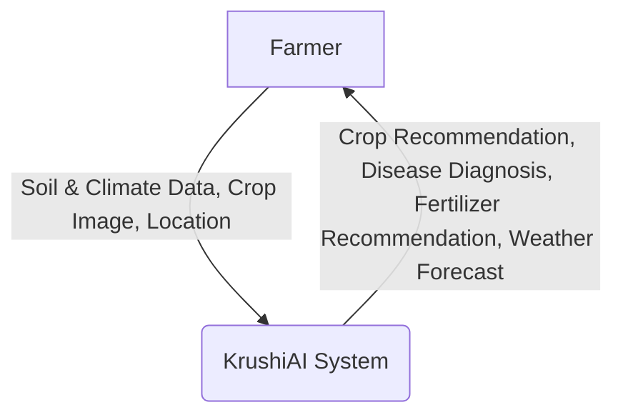
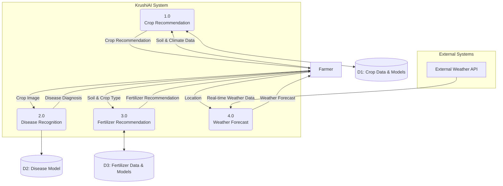
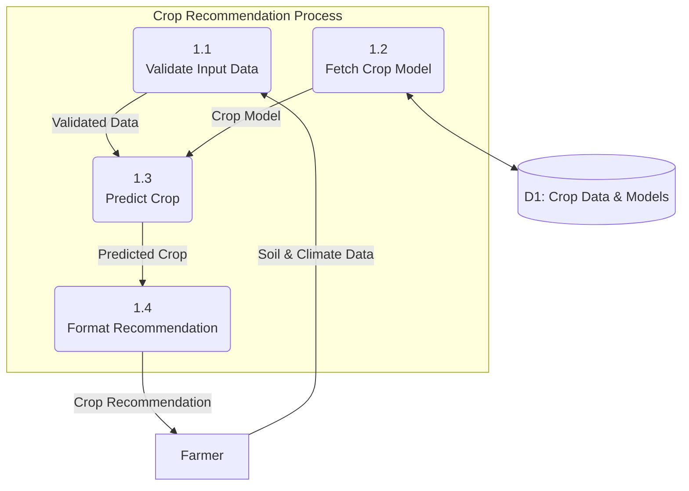
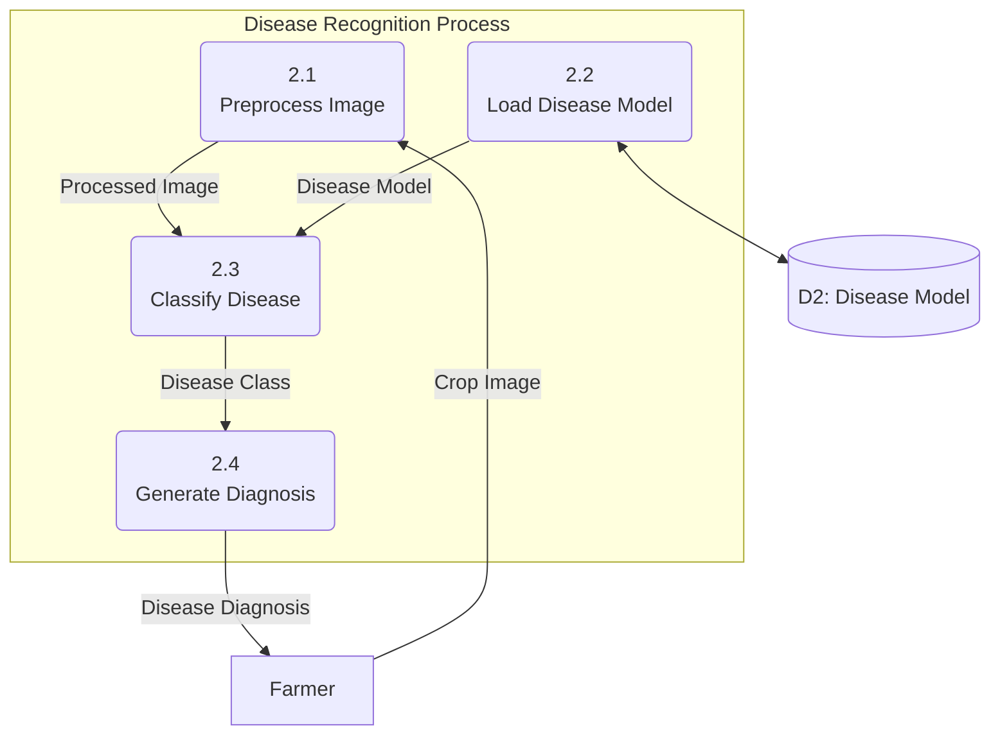

# KrushiAI Data Flow Diagrams (DFD)

This document contains the Data Flow Diagrams for the KrushiAI system.

## DFD Level 0: Context Diagram

The Context Diagram provides a high-level overview of the KrushiAI system, showing it as a single process and its interaction with external entities.

## DFD Level 1

This diagram breaks down the KrushiAI system into its main functions, illustrating how data flows between these functions, external entities, and data stores.

## DFD Level 2

This level provides a more detailed view of the key processes within the KrushiAI system.

### DFD Level 2: Crop Recommendation (Process 1.0)

### DFD Level 2: Disease Recognition (Process 2.0)

